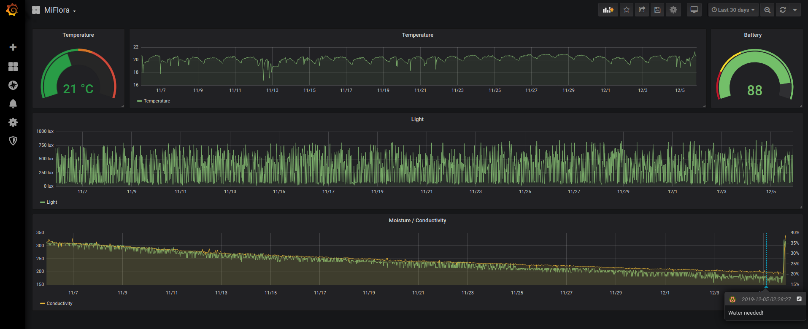

# check_miflora
check_miflora is a Python 3 Monitoring Plugin that checks the health of your (real world) flowers with a 10$ Xiaomi Mi Flora bluetooth sensor.

## Requirements

* Mi flora sensor
* Linux host with working bluetooth module (for example a newer raspberry pi)
* Python libs
    * miflora
    * nagiosplugin
* bluez tools (hcitool & gatttool)

## Installation

Install requirements (bluez via packet manager, python librarys via pip), move check_miflora.py to your monitoring libexec directory and make it executable:

```bash
apt install bluez
pip install miflora nagiosplugin
mv check_miflora.py /usr/local/nagios/libexec/
chmod 755 /usr/local/nagios/libexec/check_miflora.py
```
To get the mac address of your miflora, start a scan:

```bash
hcitool lescan
C4:7C:8D:59:31:5F Flower mate
```
## Usage

```
usage: check_miflora.py [-h] -m MAC [--temperature-warning RANGE]
                        [--temperature-critical RANGE]
                        [--moisture-warning RANGE] [--moisture-critical RANGE]
                        [--light-warning RANGE] [--light-critical RANGE]
                        [--conductivity-warning RANGE]
                        [--conductivity-critical RANGE]
                        [--battery-warning RANGE] [--battery-critical RANGE]
                        [-v]

optional arguments:
  -h, --help            show this help message and exit
  -m MAC, --mac MAC     Miflora MAC address
  --temperature-warning RANGE
                        return warning if temperature is outside RANGE
  --temperature-critical RANGE
                        return critical if temperature is outside RANGE
  --moisture-warning RANGE
                        return warning if moisture is outside RANGE
  --moisture-critical RANGE
                        return critical if moisture is outside RANGE
  --light-warning RANGE
                        return warning if light is outside RANGE
  --light-critical RANGE
                        return critical if light is outside RANGE
  --conductivity-warning RANGE
                        return warning if conductivity is outside RANGE
  --conductivity-critical RANGE
                        return critical if conductivity is outside RANGE
  --battery-warning RANGE
                        return warning if battery is outside RANGE
  --battery-critical RANGE
                        return critical if battery is outside RANGE
  -v, --verbose         increase output verbosity (use up to 3 times)
```

## Examples

### Commandline

```bash
./check_miflora.py --mac C4:7C:8D:59:31:5F
ENVIRONMENT OK - Temperature is 20.6, Moisture is 36, Light is 751, Conductivity is 342, Battery is 87
```
### Grafana Dashboard



## Contributing
Pull requests are welcome. For major changes, please open an issue first to discuss what you would like to change.

## License
[MIT](https://choosealicense.com/licenses/mit/)

